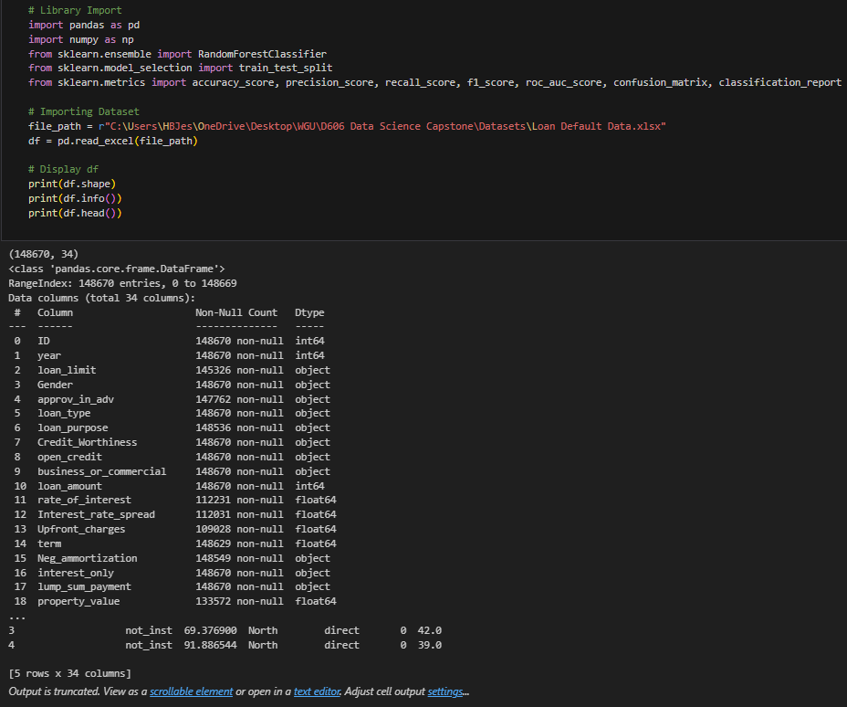
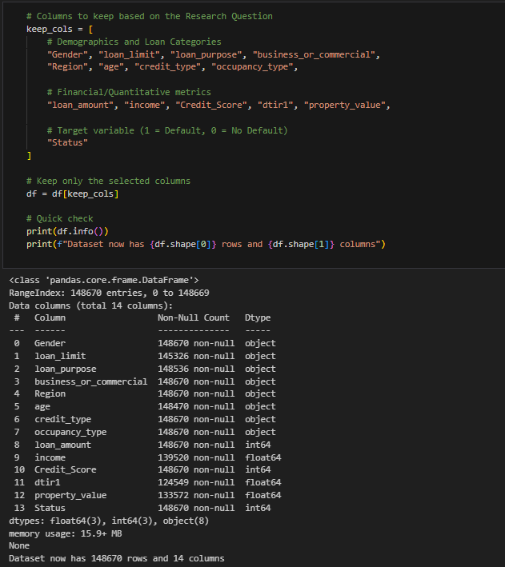

# Loan Default Risk Capstone

## Overview
This project predicts borrower loan default status using a Random Forest classifier trained on 148,670 historical loan records. The goal is to support credit risk review by identifying borrowers with elevated default risk before approval.

## Coursework Context
This repository packages work originally completed as part of Western Governors University's (WGU) M.S. in Data Analytics program and reorganizes it into a public portfolio format. Screenshots extracted from the original written submission are preserved in `assets/report-extracts/`.

## Business Question
To what extent do financial characteristics such as loan amount, annual income, credit score, and debt-to-income ratio affect a borrower's likelihood of default?

## Dataset
- Source: WGU-provided Loan Default dataset
- Original size: 148,670 rows, 34 columns
- Modeling set: 121,447 rows after removing records with missing values
- Selected features: 13 predictors plus the binary target `Status`
- Class balance after cleaning: 101,631 non-default vs. 19,816 default

## Workflow
1. Reduced the original dataset to 14 columns aligned to the research question
2. Removed rows with missing values instead of imputing sensitive financial fields
3. One-hot encoded 8 categorical variables
4. Split the data with stratification into 70% train, 15% validation, and 15% test
5. Trained a baseline Random Forest with `class_weight="balanced"`
6. Tuned the model with `GridSearchCV` using 5-fold cross-validation and ROC-AUC scoring
7. Evaluated the tuned model on an untouched test set

## Model
- Algorithm: Random Forest Classifier
- Baseline model: `n_estimators=300`
- Tuned model: `n_estimators=500`, `max_depth=None`, `max_features='sqrt'`, `min_samples_leaf=2`, `min_samples_split=2`
- Hyperparameter search: 48 candidates, 240 total fits

## Results
### Baseline Validation Performance
- Accuracy: 0.853
- Precision: 0.758
- Recall: 0.148
- F1-score: 0.248
- ROC-AUC: 0.733

### Tuned Test Performance
- Accuracy: 0.847
- Precision: 0.570
- Recall: 0.265
- F1-score: 0.362
- ROC-AUC: 0.737

## Selected Visuals

## Key Takeaways
- Hyperparameter tuning improved recall from 0.148 to 0.265, increasing the model's ability to identify true defaulters.
- The final ROC-AUC of 0.737 shows meaningful predictive power above random guessing.
- This model is best framed as a decision-support tool for underwriting rather than a fully automated approval system.

## Included Files
- `notebooks/DS_Capstone.ipynb`
- `data/Loan Default Data.xlsx`
- `requirements.txt`

## Note
The dataset is included in the staging copy so the notebook can use a repo-relative path.
